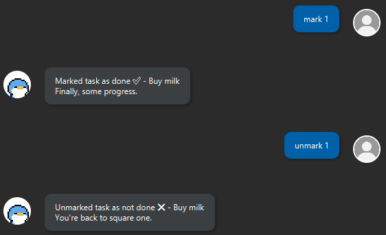

# Rucia Chatbot User Guide


Rucia is a personal assistant chatbot designed to help users manage tasks and notes efficiently. It allows users to add, delete, and modify tasks such as To-Dos, Deadlines, and Events, while also supporting note-taking functionality.

To get started, simply launch the chatbot and type `help` or `?` to view a list of available commands.

## Features
The common commands for Rucia are listed here, for the full list of commands, refer to the [Command Guide](#command-guide).
- [Adding Tasks](#adding-tasks)
- [Listing Tasks](#listing-tasks)
- [Deleting Tasks](#deleting-tasks)
- [Marking Tasks](#marking-tasks)
- [Storing Notes](#notes)

### Adding Tasks
Rucia allows you to add three types of tasks to suit all your needs.
- To-Dos: Simple day-to-day reminders.
- Deadlines: Tasks with specific due dates.
- Events: Scheduled activities or appointments with a start and end date.

#### Example Usage
```
add Buy milk
deadline Complete homework /by 13/03/2025 2359
event Vietnam holiday /from 15/03/2025 /to 21/03/2025
```


Note: All dates are entered in `dd/mm/yyyy hhmm` format, the hours and minutes are optional and will default to `12pm` if not specified.

### Listing Tasks
Simply entering `list` will bring up the list of all tasks that you currently have recorded.

If you require a more specific search, you can use the `list_day` command with a specified date.

#### Example Usage
```
list
list_day 13/03/2025
``` 

### Deleting Tasks
Tasks can be deleted with the `delete` command, followed by the task number. If you need to delete all tasks, use the `clear` command.

If you need to find out a task's number, use the `list` command.

### Example Usage
```
delete 5
clear
```


### Marking Tasks
Tasks can be marked and unmarked with the `mark` and `unmark` commands respectively, followed by the task number. 

If you need to find out a task's number, use the `list` command.

#### Example Usage
```
mark 2
unmark 5
```


### Notes
Rucia also supports the storing of notes. You can add a note with `note` and view a stored note with `view_note`, followed by the note number.

You can similarly use the ``notes`` command to find the number of a note.

#### Example Usage
```
note Example Note /desc This is the contents of this note.
view_note 1
```


## FAQ
#### 1. How do I save my tasks and notes?
Rucia automatically saves all tasks and notes whenever you add, modify, or delete them. You don’t need to manually save anything.

#### 2. Can I edit a task or note after adding it?
Currently, Rucia does not support editing tasks or notes. You will need to delete the existing task/note and create a new one with the updated details.

#### 3. What happens if I close the application? Will I lose my data?
No, Rucia automatically saves all tasks and notes, so your data will be available the next time you open the application.

#### 4. How do I check which tasks I need to complete today?
Use the `list_day <dd/mm/yyyy>` command to see all tasks scheduled for a specific day.

#### 5. Is there a way to reset all tasks and notes?
Yes, you can use the clear command to delete all tasks and `delete_note <note id>` to remove notes individually.

#### 6. What should I do if Rucia doesn’t recognize my command?
Ensure that you're typing the command correctly. You can type help to see the full list of commands.

#### 7. Can I customize Rucia’s appearance or responses?
Not at the moment, but future updates may include customization options. Stay tuned!

## Command Guide

|Command|Description|Syntax|
|--------------|-----------|-------|
|help|Lists all available commands|`help`|
|help notes| Lists all note-related commands`|`help notes`|
|add|Adds a To-Do task|`add <task>`|
|deadline|Adds a task with a deadline|`deadline <task> /b <date>`|
|event| Adds a task with a start and end date|`event <task> /from <date> to <date>`|
|list|Lists all added tasks|`list`|
|list_day|Lists all tasks for a specified day|`list_day <date>`|
|find|List all tasks matching any of the provided keywords|`find <keyword 1>, <keyword 2>, ...`
|mark|Marks the specified task as completed|`mark <task id>`|
|unmark|Marks the specified task as incomplete|`unmark <task id>`|
|delete|Deletes the specified task|`delete <task id>`|
|clear|Deletes all tasks|`clear`|
|cheer|Sends a random motivational quote|`cheer`|
|note|Adds a new note|`note <title> /desc <description>`|
|notes|List all saved notes|`notes`|
|view_note|View full details about the specified note|`view_note <note id>`|
|delete_note|Deletes the specified note|`delete_note <note id>`|
|bye|Exits the application|`bye`|


