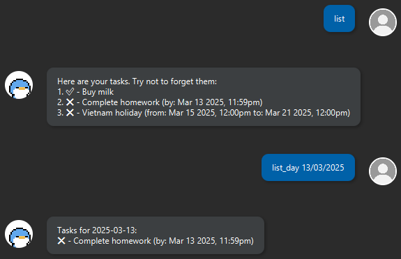

# Rucia Chatbot User Guide


Rucia is a personal assistant chatbot designed to help users manage tasks and notes efficiently. It allows users to add, delete, and modify tasks such as To-Dos, Deadlines, and Events, while also supporting note-taking functionality.

To get started, simply launch the chatbot and type `help` or `?` to view a list of available commands.

## Features
The common commands for Rucia are listed here, for the full list of commands, refer to the [Command Guide](#command-guide).
- [Adding Tasks](#adding-tasks)
- [Listing Tasks](#listing-tasks)
- [Deleting Tasks](#deleting-tasks)
- [Marking Tasks](#marking-tasks)
- [Storing Notes](#notes)

### Adding Tasks
Rucia allows you to add three types of tasks to suit all your needs.
- To-Dos: Simple day-to-day reminders.
- Deadlines: Tasks with specific due dates.
- Events: Scheduled activities or appointments with a start and end date.

#### Example Usage
```
add Buy milk
deadline Complete homework /by 13/03/2025 2359
event Vietnam holiday /from 15/03/2025 /to 21/03/2025
```


Note: All dates are entered in `dd/mm/yyyy hhmm` format, the hours and minutes are optional and will default to `12pm` if not specified.

### Listing Tasks
Simply entering `list` will bring up the list of all tasks that you currently have recorded.

If you require a more specific search, you can use the `list_day` command with a specified date.

#### Example Usage
```
list
list_day 13/03/2025
``` 

### Deleting Tasks
Tasks can be deleted with the `delete` command, followed by the task number. 

If you need to find out a task's number, use the `list` command.

### Example Usage
```
delete 5
```

### Marking Tasks
Tasks can be marked and unmarked with the `mark` and `unmark` commands respectively, followed by the task number. 

If you need to find out a task's number, use the `list` command.

#### Example Usage
```
mark 2
unmark 5
```

### Notes
Rucia also supports the storing of notes. You can add a note with `note` and view a stored note with `view_note`, followed by the note number.

You can similarly use the ``notes`` command to find the number of a note.

#### Example Usage
```
note Example Note /desc This is the contents of this note.
view_note 1
```

## FAQ

## Command Guide

Below is a table of common commands:

|Command|Description|Example|
|-------|-----------|-------|
|add|Adds a To-Do task|`add Buy milk`|
|deadline|Adds a task with a deadline|`deadline Complete homework /by 13/03/2025 2359`|


